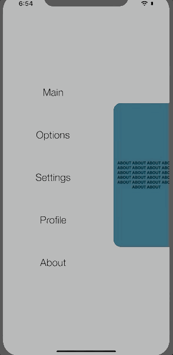

# Outsider
iOS Side Menu

## 1. Configurations

        let contentVC = UIStoryboard(name: "Main", bundle: nil).instantiateViewController(withIdentifier: Storyboards.Main.rawValue) as? MainViewController
        let menuVC = UIStoryboard(name: "Main", bundle: nil).instantiateViewController(withIdentifier: Storyboards.SideMenu.rawValue) as? SideMenuViewController
        
        let setupConfigurations: SetupConfigurations = .init(contentViewController: contentVC!,
                                                             menuViewController: menuVC!,
                                                             shouldContentEmbedInNavigationController: true,
                                                             shouldShowContentViewControllerAfterSetup: false,
                                                             shouldHideContentViewControllerNavigationBarWhenScaled: true,
                                                             shouldHideContentViewControllerNavigationBarWhenPushed: false)
        setup(configurations: setupConfigurations)

## 2. Usage tips

    class SideMenuViewController: UIViewController, OutSiderMenuProtocol {
      @IBAction func mainButtonTapped(_ sender: UIButton) {
        let vc = UIStoryboard(name: "Main", bundle: nil).instantiateViewController(withIdentifier: Storyboards.Main.rawValue) as? MainViewController
        showContent(viewController: vc!)
      } 
    }
    
## 2. Delegates
    class SideMenuViewController: UIViewController, OutSiderMenuProtocol {
      func menuWillAppear() {
        // Menu WillAppear
      }
      func menuWillDisappear() {
        // Menu WillDisappear
      }
      func menuDidAppear() {
        // Menu DidAppear
      }
      func menuDidDisappear() {
        // Menu DidDisappear
      }
    }

 
    class MainViewController: UIViewController, OutSiderContentProtocol {
      func contentWillAppear() {
        // MainViewController WillAppear
      }
      
      func contentWillDisappear() {
       // MainViewController WillDisappear
      }
      
      func contentDidAppear() {
        // MainViewController DidAppear
      }
      
      func contentDidDisappear() {
        // MainViewController DidDisappear
      }
    }

https://m.youtube.com/watch?v=EYspF1qHhEI
